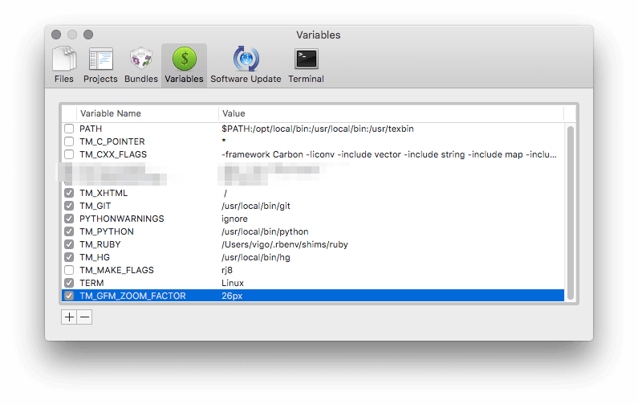

# GitHub Flavored Markdown Preview for TextMate2

If you are TextMate1 user, you can have [TextMate1 edition of the bundle][ln-01] too :)

## Requirements

I’m assuming that you have `ruby` and `bundler` gem installed. Ruby version 
must be ` >= 2.0`.

## Install

```bash
cd "~/Library/Application Support/Avian/Bundles/"
git clone https://github.com/vigo/textmate2-gfm-preview.git textmate2-gfm-preview.tmbundle
cd textmate2-gfm-preview.tmbundle/
bundle install --path=gems
```

You can define `TM_GFM_ZOOM_FACTOR` variable from *TextMate > Preferences > Variables* 
for text-zoom. Example Settings:



Sample screens with/out zoom factor:


Now you can hit `⌃ +  ⌥ +  ⌘ + p` or `kntrl + alt + cmd + p`

## Features

### Fenced Code Blocks

    ```ruby
    require 'redcarpet'
    markdown = Redcarpet.new("Hello World!")
    puts markdown.to_html
    ```

```ruby
require 'redcarpet'
markdown = Redcarpet.new("Hello World!")
puts markdown.to_html
```

### Tables: Example 1

    | First Header  | Second Header |
    | ------------- | ------------- |
    | Content Cell  | Content Cell  |
    | Content Cell  | Content Cell  |

Output:

| First Header  | Second Header |
| ------------- | ------------- |
| Content Cell  | Content Cell  |
| Content Cell  | Content Cell  |

***

### Tables: Example 2

    | Name          | Description                 |
    | ------------- | --------------------------- |
    | Help          | ~~Display the~~ help window.|
    | Close         | _Closes_ a window           |

Output:

| Name          | Description                 |
| ------------- | --------------------------- |
| Help          | ~~Display the~~ help window.|
| Close         | _Closes_ a window           |

***

### Tables: Example 3

    | Left-Aligned  | Center Aligned  | Right Aligned |
    | :------------ |:---------------:| -------------:|
    | col 3 is      | some wordy text |         $1600 |
    | col 2 is      | centered        |           $12 |
    | zebra stripes | are neat        |            $1 |

Output:

| Left-Aligned  | Center Aligned  | Right Aligned |
| :------------ |:---------------:| -------------:|
| col 3 is      | some wordy text |         $1600 |
| col 2 is      | centered        |           $12 |
| zebra stripes | are neat        |            $1 |

***

## Change Log

**2016-04-25**

* Added: `TM_GFM_ZOOM_FACTOR` for zoom options
* Auto-save! If you open an existing file and hit preview, you don’t need
to save!

**2016-03-20**

* converted TM1 edition of this bundle to TM2
* fixed: You don’t need to `save` before preview!

***

## Contribute

PR’s are very welcome!

1. `fork` (https://github.com/vigo/textmate2-gfm-preview/fork)
2. Create your `branch` (`git checkout -b my-features`)
3. `commit` yours (`git commit -am 'added killer features'`)
4. `push` your `branch` (`git push origin my-features`)
5. Than create a new **Pull Request**!

***

## Contributer(s)

* [Uğur "vigo" Özyılmazel][vigo] - Creator, maintainer

***

## License

This project is licensed under MIT.

[vigo]:  http://ugur.ozyilmazel.com "Official Homepage"
[ln-01]: https://github.com/vigo/textmate1-github-gfm-preview