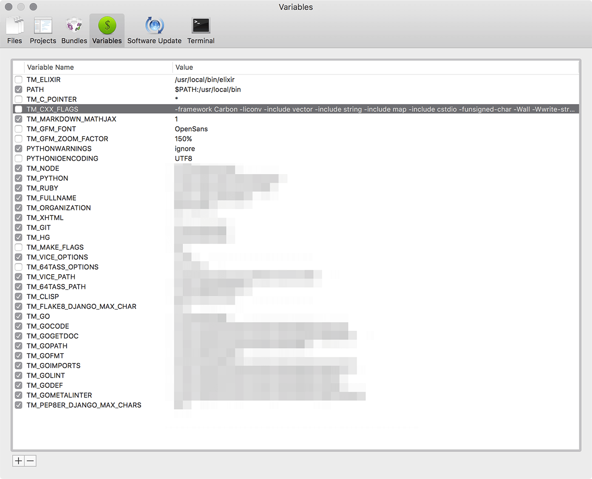
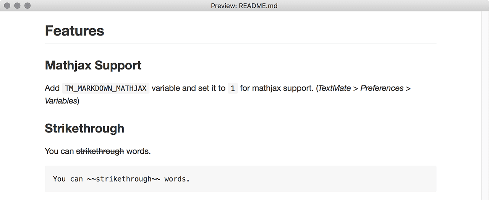

# GitHub Flavored Markdown Preview for TextMate2

Write and preview your Markdown files like a Boss! (*Sorry, TextMate1 is
dead...*)

## Requirements

- Ruby 2.4.0
- Please set your `TM_RUBY` environment variable in TextMate.

Example of `TM_RUBY` configuration:

```bash
which ruby
# /Users/vigo/.rbenv/shims/ruby

defaults write com.macromates.textmate environmentVariables -array-add '{enabled = 1; value = "/Users/vigo/.rbenv/shims/ruby"; name = "TM_RUBY"; }'
# Restart your TextMate
```


## Install & Update

```bash
cd ~/Library/Application\ Support/TextMate/Bundles/
git clone https://github.com/vigo/textmate2-gfm-preview.git GFM-Preview.tmbundle
cd GFM-Preview.tmbundle/
bundle install --path vendor/bundle

# If you want to update time-to-time
cd ~/Library/Application\ Support/TextMate/Bundles/GFM-Preview.tmbundle
git pull
```

You can define;

- `TM_GFM_ZOOM_FACTOR`: For zooming text.
- `TM_MARKDOWN_MATHJAX`: For Mathjax support.
- `TM_GFM_FONT`: For custom font which is installed to your `~/Fonts`

variables from *TextMate > Preferences > Variables* for customizing extra
features. Or do it from shell:

```bash
# assuming that, `OpenSans` font already installed on your ~/Library/Fonts

defaults write com.macromates.textmate environmentVariables -array-add \
    '{enabled = 1; value = "26px"; name = "TM_GFM_ZOOM_FACTOR"; }' \
    '{enabled = 1; value = 1; name = "TM_MARKDOWN_MATHJAX"; }' \
    '{enabled = 1; value = "OpenSans"; name = "TM_GFM_FONT"; }'
```


Example Settings:



With **26px** zoom:


Without zoom:



Now you can hit `⌃ +  ⌥ +  ⌘ + p` or `kntrl + alt + cmd + p`

## Features

### Mathjax Support

Add `TM_MARKDOWN_MATHJAX` variable and set it to `1` for mathjax support.
(*TextMate > Preferences > Variables*)

### Strikethrough

You can ~~strikethrough~~ words.
    
    You can ~~strikethrough~~ words.

### Superscript

This is your 2^(nd) attempt.  

    This is your 2^(nd) attempt.

### Underline

This is _underlined_ but this is still *italic*

    This is _underlined_ but this is still *italic*

### Highlight

This is ==highlighted== text.

    This is ==highlighted==

### Quote

This is a "quote"

    This is a "quote"

### Footnotes

Click to jump footnote.[^1]
[^1]: This is a footnote.

    Click to jump footnote.[^1]
    [^1]: This is a footnote.

### Fenced Code Blocks

    ```ruby
    require 'redcarpet'
    markdown = Redcarpet.new("Hello World!")
    puts markdown.to_html
    ```

```ruby
require 'redcarpet'
markdown = Redcarpet.new("Hello World!")
puts markdown.to_html
```

### Tables: Example 1

    | First Header  | Second Header |
    | ------------- | ------------- |
    | Content Cell  | Content Cell  |
    | Content Cell  | Content Cell  |

Output:

| First Header  | Second Header |
| ------------- | ------------- |
| Content Cell  | Content Cell  |
| Content Cell  | Content Cell  |

***

### Tables: Example 2

    | Name          | Description                 |
    | ------------- | --------------------------- |
    | Help          | ~~Display the~~ help window.|
    | Close         | _Closes_ a window           |

Output:

| Name          | Description                 |
| ------------- | --------------------------- |
| Help          | ~~Display the~~ help window.|
| Close         | _Closes_ a window           |

***

### Tables: Example 3

    | Left-Aligned  | Center Aligned  | Right Aligned |
    | :------------ |:---------------:| -------------:|
    | col 3 is      | some wordy text |         $1600 |
    | col 2 is      | centered        |           $12 |
    | zebra stripes | are neat        |            $1 |

Output:

| Left-Aligned  | Center Aligned  | Right Aligned |
| :------------ |:---------------:| -------------:|
| col 3 is      | some wordy text |         $1600 |
| col 2 is      | centered        |           $12 |
| zebra stripes | are neat        |            $1 |

***

## Change Log

**2017-07-02**

* Removed: Pygments
* New syntax highlighter: `rouge`
* Updated to Ruby 2.4.0
* Added: Front-Matter filter for Preview. Thanks to [noniq][noniq] for [Markdown-Front-Matter][markdown-fm-bundle]

**2017-01-08**

* Fix: live preview.

**2017-01-02**

* Fix: Broken footnotes due to base href.
* New feature: Custom font-family via `TM_GFM_FONT` env-var.

**2017-01-01**

* Support for relative image src: `` looks for `picture.png` in current folder.

**2016-10-04**

* Fix zoom factor for TABLEs
* Automatic refresh for Preview (*comes with TextMate version 2.0-beta.12.21*) 
when you save file.

**2016-09-14**

* Added: Mathjax support.
* Added more `redcarpet` features: Strikethrough, Superscript, Underline, Highlight, 
Quote, Footnotes. Please preview this readme file via bundle. GitHub doesn’t support
some of the features (*highlight, superscript, underline, footnote etc...*)


**2016-04-25**

* Added: `TM_GFM_ZOOM_FACTOR` for zoom options
* Auto-save! If you open an existing file and hit preview, you don’t need
to save!

**2016-03-20**

* converted TM1 edition of this bundle to TM2
* fixed: You don’t need to `save` before preview!

***

## Contribute

PR’s are very welcome!

1. `fork` (https://github.com/vigo/textmate2-gfm-preview/fork)
2. Create your `branch` (`git checkout -b my-features`)
3. `commit` yours (`git commit -am 'added killer features'`)
4. `push` your `branch` (`git push origin my-features`)
5. Than create a new **Pull Request**!

***

## Contributer(s)

* [Uğur "vigo" Özyılmazel][vigo] - Creator, maintainer

***

## License

This project is licensed under MIT.

[vigo]:  http://ugur.ozyilmazel.com "Official Homepage"
[ln-01]: https://github.com/vigo/textmate1-github-gfm-preview
[noniq]: https://github.com/noniq
[markdown-fm-bundle]: https://github.com/noniq/Markdown-Front-Matter.tmbundle/blob/master/Support/strip_front_matter
